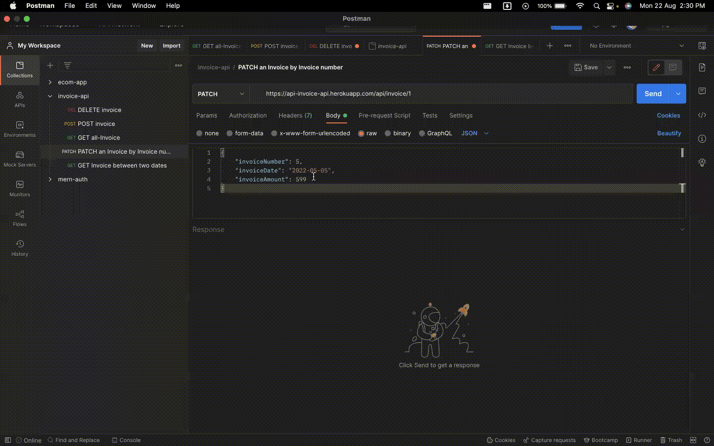

<h1 align="center"><b>INVOICE API</b></h1>

<h2 align="center"> Technokart Assignment </h2>    

<br />

<p align="center">

 

 

</p>

## Problem Statement

#### Description : 
Create an API which would accept 3 parameters. 

1. Invoice Date. 
2. Invoice Number. 
3. Invoice Amount. 

You have to store these details in the db (Mongodb Atlas). The logic to store the data would be as follows :- 

The Invoice date should not be greater than the invoice date of previous or next invoice number. 
E.g.
- Invoice number 1 has invoice date 3rd July 2022. 
Invoice number 3 has invoice date 5th July 2022.

- So when I put invoice number 2, it’s date should lie
between 3rd July and 5th July, such validation should be
there at the backend. o Also a clean code, commented
code is a plus, along with Readme.md for documentation.

#### You have to create 4 end points :
- Enter new invoice details.
- Update a specific invoice based on invoice number
- Delete a specific invoice based on invoice number
- Get all invoices stored in the db
- Get invoices between 2 dates

<br />


## API Reference

#### To GET all Invoice  

```
  https://api-invoice-api.herokuapp.com/api/invoice
```
#### To GET Invoice between two dates

```
    https://api-invoice-api.herokuapp.com/api/invoice/date/:endDate/:startDate/
```
```
    https://api-invoice-api.herokuapp.com/api/invoice/date/2022-06-01/2022-05-05/
```

#### To POST/CREATE an Invoice

```
   https://api-invoice-api.herokuapp.com/api/invoice
```

#### To PATCH an Invoice by Invoice number

```
   https://api-invoice-api.herokuapp.com/api/invoice/:number
```
#### To DELETE an Invoice by Invoice number

```
   https://api-invoice-api.herokuapp.com/api/invoice/:number
```


## Presentation

#### To GET all Invoice  


#### To GET Invoice between two dates


#### To POST/CREATE an Invoice


#### To PATCH an Invoice by Invoice number


#### To DELETE an Invoice by Invoice number


### Tools used on this project

- Visual Studio Code
- MongoDB Atlas
- Postman

<br/>

<h2>📬 Contact</h2>

If you want to contact me, you can reach me through below handles.

[](https://www.linkedin.com/in/aakashvani17/)
[](https://github.com/Aakashvani)

© 2022 Technokart

